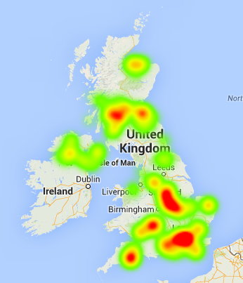

# Food Hygiene Map



A fun little foray into server side JS by accessing the [Food Hygene Ratings
API](http://api.ratings.food.gov.uk/) and eventually display this as a sort of
heat map in google-maps style thing of the country.

## Requirements and Installation

This requires:

* [Node.js](http://nodejs.org)
* [RethinkDB](http://rethinkdb.com)
* [express](http://expressjs.com)
* [request](https://github.com/mikeal/request)

RethinkDB requires installation on a system and the JavaScript bindings.

All the other dependencies can be installed via:

```sh
$ npm install
```


## Running

To run this application you will need to make sure rethinkdb is running
somewhere. An example configuration file is shown in
`rethinkdb.conf.example`.

```sh
$ rethinkdb --config-file rethinkdb.conf
$ node foodmap.js
```
